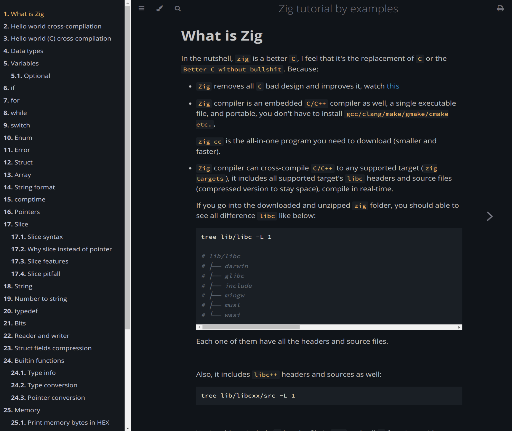
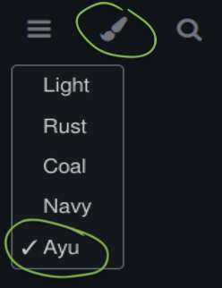

# Zig tutorial by examples

This tutorial helps you to learn `Zig` in a quick and easy way. It targets the
following audiences:

- With a system programming language background (C/C++/Rust, etc) and want to
try `zig`

- Comes from a non-system programming language background and wants to give
it a try

</br>

I wrote this tutorial as a summary after I use `zig` to write a few projects
(including 2D gaming), so that's why you always see straightforward summarises
instead of amazing fancy words in this tutorial. 

Also, you can treat this tutorial as a quick `Q&A` or manual as well. That means
you don't need to go through from top to bottom, just click the chapter you're
interested in and dive in. In some chapters, I put extra links to other important
and valuable blogs/youtube/articles, just in case you want to know more about
that topic.

I'm working on some machine learning project with `zig` at this moment,  I will
update this tutorial from time to time, hope it helps:)

</br>

# The tutorial covers the following topics with detailed examples

- What is Zig
- Hello world cross-compilation
- Hello world  cross-compilation
- Data types
- Variables
    - Optional
- if
- for
- while
- switch
- Enum
- Error
- Struct
- Import struct
- Anonymous function
- Tagged union
- Array
- String format
- Pointers
- Slice
    - Slice syntax
    - Why slice instead of pointer
    - Slice features
    - Slice pitfall
- String
- Manipulate String
- Number to string
- `typedef`
- `comptime` and generic
    - `comptime`
    - `Static dispatch`
    - Convert data type example
- Interface and dynamic dispatch
- Bits
- Everything about logging
- logging in unit test
- Reader and writer
- Struct fields compression
- Builtin functions
    - Type info
    - Type conversion
    - Pointer conversion
- Memory
    - Choose an allocator
    - Print memory bytes in HEX
- Build System
    - Release build
    - Conditional compilation
    - Build multiple targets
    - Customize build step
    - A pitfall when using dependOn
    - Add existing library
    - Compile C project
    - Modules and dependencies
    - Pass build option to dependencies
    - Test fixed dependencies locally
- Working with C
    - Equivalent functions in `Zig`
    - Variadic functions in `Zig`
- How to
    - Read environment variable
    - Execute command
    - Use ArrayList
    - Use HashMap
    - Handle JSON
    - Iterator pattern
    - Multithreading
    - Send HTTP request

</br>



</br>

## How to run

The tutorial is created with **`mdbook`**.

- How to install **`mdBook`**

    ```bash
    # Arch Linux
    pacman --sync --refresh mdbook

    # MacOS
    brew install mdbook

    # If you've alreday install `cargo`
    cargo install mdbook
    ```

    Or download the pre-compiled binary from [here](https://github.com/rust-lang/mdBook/releases)

    </br>

- How to view the tutorial in your browser

  Make sure you're in the repo root folder and run:

    ```bash
    # Clean the prev build
    mdbook clean

    # Serve it via local HTTP server
    mdbook serve --open
    ```

    </br>

- How to export as **`PDF`**?

    Click on the print icon on the right-top to save as **`PDF`**.

    </br>

- Choose a different theme

    

    </br>

